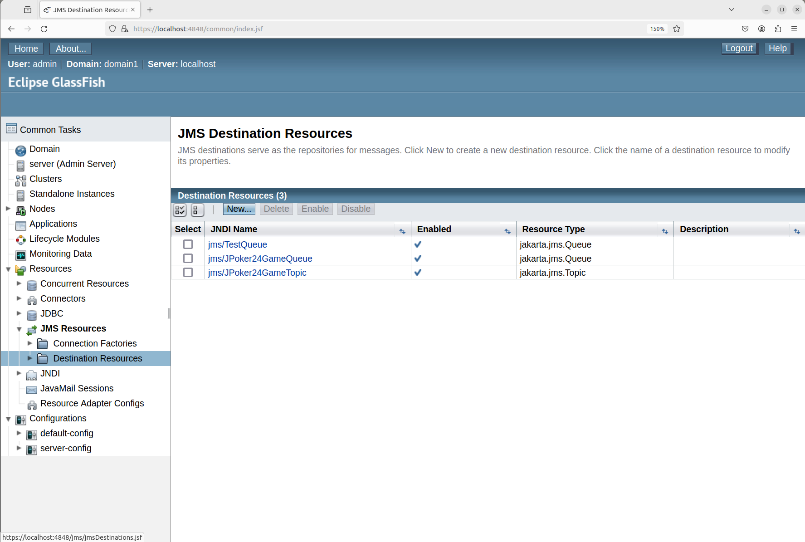
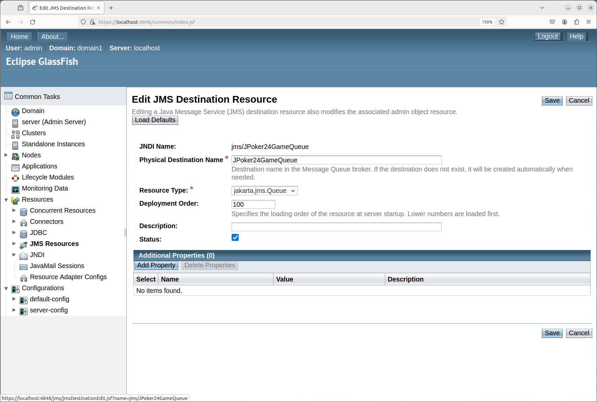

# HKU-COMP3358-JPoker24 Report

**Document Directory**
|Section|Title|Link|
|-|-|-|
|1|Environment Set Up|[Link](#1-environment-set-up)|
|2|How to Run|[Link](#2-how-to-run-the-program)|
|3|Game Demo|[Link](#3-game-demo)|

## 1. Environment Set Up

This section provides a guidence on how to set up the environment to run the jar.

### 1.1 Overview

**System**

- Linux Ubuntu 22.04

**Dependencies**

- openjdk version "11.0.22" 2024-01-16
- mysql Ver 8.0.36-0ubuntu0.22.04.1 for Linux on x86_64 ((Ubuntu))
- mysql-connector-j_8.4.0-1ubuntu22.04_all
- glassfish-6.1.0

**Assumption**

- RMI, JMS use localhost.

### 1.2 Set Up MySQL

#### 1.2.1 Install MySQL

Install MySQL server in Linux terminal.

```bash
sudo apt install mysql-server
sudo service mysql status
sudo apt install mysql-client
```

#### 1.2.2 Set Up Database & Tables

Open MySQL Console.

```bash
sudo mysql -u root -p
```

Set Up Database and Database User.

```sql
CREATE DATABASE GameDB;
CREATE USER 'gameUser'@'localhost' IDENTIFIED BY 'gamePassword';
GRANT ALL PRIVILEGES ON GameDB.* TO 'gameUser'@'localhost';
FLUSH PRIVILEGES;
```

Switch to the Game Database.

```sql
USE GameDB;
```

Set Up Tables.

```sql
CREATE TABLE Users (
    name VARCHAR(32) NOT NULL,
    password VARCHAR(32) NOT NULL,
    is_online BOOLEAN NOT NULL DEFAULT FALSE,
    PRIMARY KEY (name)
);

CREATE TABLE Games (
    id INT NOT NULL AUTO_INCREMENT,
    completion_time DECIMAL(10, 3),
    PRIMARY KEY (id)
);

CREATE TABLE Participations (
    game_id INT NOT NULL,
    user_name VARCHAR(32) NOT NULL,
    is_winner BOOLEAN NOT NULL DEFAULT FALSE,
    PRIMARY KEY (user_name, game_id),
    FOREIGN KEY (user_name) REFERENCES Users(name),
    FOREIGN KEY (game_id) REFERENCES Games(id)
);
```

Quit MySQL Console.

```sql
\q
```

#### 1.2.3 Prepare MySQL JDBC Driver

- Download MySQL JDBC driver `mysql-connector-j_8.4.0-1ubuntu22.04_all` at [http://dev.mysql.com/downloads/connector/j/](http://dev.mysql.com/downloads/connector/j/)

- Find the **`mysql-connector-j-8.4.0.jar`** at `.../mysql-connector-j_8.4.0-1ubuntu22.04_all/usr/share/java/mysql-connector-j-8.4.0.jar`, and remember the path to it as **`$mysql_connector_path`**.

### 1.3 Set Up Glassfish 6.1.0 (JMS Service)

- **Important**: Glassfish 6.1.0 is very different from Glassfish 5, since it migrate the `jms` package from `javax.jms` to `jakarta.jms`. Please **DO NOT** run this application under Glassfish 5.

#### 1.3.1 Install Glassfish 6.1.0 on Linux Ubuntu

- Follow the tutorial at [https://www.howtoforge.com/how-to-install-glassfish-on-ubuntu-22-04/](https://www.howtoforge.com/how-to-install-glassfish-on-ubuntu-22-04/) to download and set up glassfish 6.1.0.
- Suppose you follow the guideline and download the `glassfish-6.1.0`.

- Find the **`gf-client.jar`** at `.../glassfish-6.1.0/glassfish6/glassfish/lib/gf-client.jar`, and remember the path to it as **`$gf_client_path`**.

#### 1.3.2 Set Up Glassfish JMS Service

- Enter you glassfish admin console at [http://localhost:4848](http://localhost:4848), and login to it.
- Under side bar, navigate to `Resources -> JMS Resources -> Connection Factories`.

  

- Click `New` Button on the right Panel to create a `JPoker24GameConnectionFactory`, the field `JNDI Name` is `jms/JPoker24GameConnectionFactory` and the `Resource Type` is `jakarta.jms.ConnectionFactory`.

  

- Under side bar, navigate to `Resources -> JMS Resources -> Destination Resources`.

  

- Click `New` Button on the right Panel to create a `JPoker24GameQueue`, the field `JNDI Name` is `jms/JPoker24GameQueue`, the `Physical Destination Name` is `JPoker24GameQueue`, and the `Resource Type` is `jakarta.jms.Queue`.

  

- Click `New` Button on the right Panel to create a `JPoker24GameTopic`, the field `JNDI Name` is `jms/JPoker24GameTopic`, the `Physical Destination Name` is `JPoker24GameTopic`, and the `Resource Type` is `jakarta.jms.Topic`.

  

## 2 How to Run the Program

#### 2.1 Run Server & Client

1. Open the terminal under `JPoker24Game` directory. Copy `glassfish-6.1.0` and `mysql-connector-j_8.4.0-1ubuntu22.04_all`, which you download in **section 1.2.3** and **1.3.1** respectively, under `lib` if you want to directly copy and paste the command to run `.jar` file.

   **File Structure of Submitted File**

   ```
   JPoker24Game                (Open Linux Terminal Here)
   ├── lib
   │   ├── glassfish-6.1.0
   │   └── mysql-connector-j_8.4.0-1ubuntu22.04_all
   ├── JPoker24Game.jar
   ├── JPoker24GameServer.jar
   └── security.policy
   ```

2. Enter command below to check the **availability of port 1099**.

   ```bash
   sudo netstat -tulpn | grep 1099
   ```

3. If Occupied, enter command below to kill the thread. Replace **$PID** with the PID shown output of the command above. You must ensure port 1099 is available.

   ```bash
   sudo kill -9 $PID
   ```

4. To start the server, use the command template below:

   ```bash
   java -cp "$server_jar_path\
   :$mysql_connector_path\
   :$gf_client_path" \
   -Djava.security.manager -Djava.security.policy=$security_policy_path \
   com.server.ServerMain
   ```

   4.1 Replace **$server_jar_path** with path to **JPoker24GameServer.jar**.

   4.2 Replace **$mysql_connector_path** with the path to **mysql-connector-j-8.4.0.jar**.

   4.3 Replace **$gf_client_path** with path to **gf-client.jar** of glassfish 6.1.0.

   4.4 Replace **$security_policy_path** with path to **security.policy**.

   4.5 Below are the command if you run in the `/JPoker24Game` directory and using `lib` provided:

   ```bash
   java -cp "JPoker24GameServer.jar\
   :lib/glassfish-6.1.0/glassfish6/glassfish/lib/gf-client.jar\
   :lib/mysql-connector-j_8.4.0-1ubuntu22.04_all/usr/share/java/mysql-connector-j-8.4.0.jar"\
   -Djava.security.manager \
   -Djava.security.policy=security.policy \
   com.server.ServerMain
   ```

5. To start the client, use the command template below:

   ```bash
   java -cp "$client_jar_path\
   :$gf_client_path" \
   -Djava.security.manager \
   -Djava.security.policy=$security_policy_path \
   com.client.ClientMain localhost
   ```

   5.1 Replace **$client_jar_path** with path to **JPoker24Game.jar**.

   5.2 Replace **$gf_client_path** with path to **gf-client.jar** of glassfish 6.1.0.

   5.3 Replace **$security_policy_path** with path to **security.policy**.
   5.4 Below are the command if you run in the `/JPoker24Game` directory and using `lib` provided::

   ```bash
   java -cp "JPoker24Game.jar\
   :lib/glassfish-6.1.0/glassfish6/glassfish/lib/gf-client.jar" \
   -Djava.security.manager \
   -Djava.security.policy=security.policy \
   com.client.ClientMain localhost
   ```

6. Ensure you provide sufficient permission in security policy. Below are a safe option.

   ```policy
   grant {
       permission java.security.AllPermission;
   };
   ```

### 2.2 Inspect the MySQL Database

1. Open MySQL console in linux terminal.

   ```bash
   sudo mysql -u root -p
   ```

2. Switch to the database we use.
   ```sql
   USE GameDB;
   ```
3. Repeatly enter commands below to inspect the three tables we created.
   ```sql
   SELECT * FROM Users;
   SELECT * FROM Games;
   SELECT * FROM Participations;
   ```

### 2.3 View Source Code

Following the instruction, the source code has been packed within the `.jar` file. To view the source code, please decompress the `.jar` file, and browse the package under `com` directory.

Please be noted that, there are some common packages shared between `JPoker24Game.jar` and `JPoker24GameServer.jar`, thus, just read once the packages with the same package name.

## 3. Game Demo

### 2.1 Login & Sign Up

### 2.2 Game PlayChapter 1 Background

### 2.2 Basic Game Stages

### 2.2 Game Start with 2-4 Players

### 2.3 Game with Multi-Session

### 2.4 Evaluation & Verification of Expression

### 2.5 Game End

### 2.6 Broadcast of Leaderboard Update

### 2.7 Related Database Update

### 2.8 Architecture of Game
