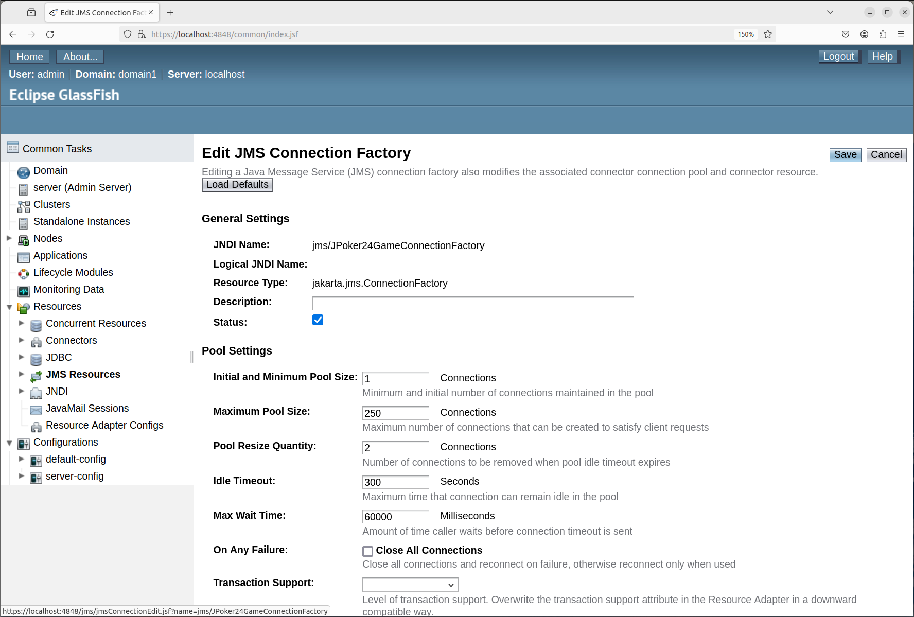

# HKU-COMP3358-JPoker24 Report

**Document Directory**
|Section|Title|Link|
|-|-|-|
|1|Environment Set Up|[Link](#1-environment-set-up)|
|2|How to Run|[Link](#2-how-to-run-the-program)|
|3|Game Demo|[Link](#3-game-demo)|

## 1. Environment Set Up

This section provides a guidence on how to set up the environment to run the jar.

### 1.1 Overview

**System**

- Linux Ubuntu 22.04

**Dependencies**

- openjdk version "11.0.22" 2024-01-16
- mysql Ver 8.0.36-0ubuntu0.22.04.1 for Linux on x86_64 ((Ubuntu))
- mysql-connector-j_8.4.0-1ubuntu22.04_all
- glassfish-6.1.0

**Assumption**

- RMI, JMS use localhost.

### 1.2 Set Up MySQL

#### 1.2.1 Install MySQL

Install MySQL server in Linux terminal.

```bash
sudo apt install mysql-server
sudo service mysql status
sudo apt install mysql-client
```

#### 1.2.2 Set Up Database & Tables

Open MySQL Console.

```bash
sudo mysql -u root -p
```

Set Up Database and Database User.

```sql
CREATE DATABASE GameDB;
CREATE USER 'gameUser'@'localhost' IDENTIFIED BY 'gamePassword';
GRANT ALL PRIVILEGES ON GameDB.* TO 'gameUser'@'localhost';
FLUSH PRIVILEGES;
```

Switch to the Game Database.

```sql
USE GameDB;
```

Set Up Tables.

```sql
CREATE TABLE Users (
    name VARCHAR(32) NOT NULL,
    password VARCHAR(32) NOT NULL,
    is_online BOOLEAN NOT NULL DEFAULT FALSE,
    PRIMARY KEY (name)
);

CREATE TABLE Games (
    id INT NOT NULL AUTO_INCREMENT,
    completion_time DECIMAL(10, 3),
    PRIMARY KEY (id)
);

CREATE TABLE Participations (
    game_id INT NOT NULL,
    user_name VARCHAR(32) NOT NULL,
    is_winner BOOLEAN NOT NULL DEFAULT FALSE,
    PRIMARY KEY (user_name, game_id),
    FOREIGN KEY (user_name) REFERENCES Users(name),
    FOREIGN KEY (game_id) REFERENCES Games(id)
);
```

Quit MySQL Console.

```sql
\q
```

#### 1.2.3 Prepare MySQL JDBC Driver

- Download MySQL JDBC driver `mysql-connector-j_8.4.0-1ubuntu22.04_all` at [http://dev.mysql.com/downloads/connector/j/](http://dev.mysql.com/downloads/connector/j/)

- Find the **`mysql-connector-j-8.4.0.jar`** at `.../mysql-connector-j_8.4.0-1ubuntu22.04_all/usr/share/java/mysql-connector-j-8.4.0.jar`, and remember the path to it as **`$mysql_connector_path`**.

### 1.3 Set Up Glassfish 6.1.0 (JMS Service)

- **Important**: Glassfish 6.1.0 is very different from Glassfish 5, since it migrate the `jms` package from `javax.jms` to `jakarta.jms`. Please **DO NOT** run this application under Glassfish 5.

#### 1.3.1 Install Glassfish 6.1.0 on Linux Ubuntu

- Follow the tutorial at [https://www.howtoforge.com/how-to-install-glassfish-on-ubuntu-22-04/](https://www.howtoforge.com/how-to-install-glassfish-on-ubuntu-22-04/) to download and set up glassfish 6.1.0.
- Suppose you follow the guideline and download the `glassfish-6.1.0`.

- Find the **`gf-client.jar`** at `.../glassfish-6.1.0/glassfish6/glassfish/lib/gf-client.jar`, and remember the path to it as **`$gf_client_path`**.

#### 1.3.2 Set Up Glassfish JMS Service

- Enter you glassfish admin console at [http://localhost:4848](http://localhost:4848), and login to it.
- Under side bar, navigate to `Resources -> JMS Resources -> Connection Factories`.

  

- Click `New` Button on the right Panel to create a `JPoker24GameConnectionFactory`, the field `JNDI Name` is `jms/JPoker24GameConnectionFactory` and the `Resource Type` is `jakarta.jms.ConnectionFactory`.

  

- Under side bar, navigate to `Resources -> JMS Resources -> Destination Resources`.

  

- Click `New` Button on the right Panel to create a `JPoker24GameQueue`, the field `JNDI Name` is `jms/JPoker24GameQueue`, the `Physical Destination Name` is `JPoker24GameQueue`, and the `Resource Type` is `jakarta.jms.Queue`.

  

- Click `New` Button on the right Panel to create a `JPoker24GameTopic`, the field `JNDI Name` is `jms/JPoker24GameTopic`, the `Physical Destination Name` is `JPoker24GameTopic`, and the `Resource Type` is `jakarta.jms.Topic`.

  

## 2 How to Run the Program

#### 2.1 Run Server & Client

1. Open the terminal under `JPoker24Game` directory. Copy `glassfish-6.1.0` and `mysql-connector-j_8.4.0-1ubuntu22.04_all`, which you download in **section 1.2.3** and **1.3.1** respectively, under `lib` if you want to directly copy and paste the command to run `.jar` file.

   **File Structure of Submitted File**

   ```
   JPoker24Game                (Open Linux Terminal Here)
   ├── lib
   │   ├── glassfish-6.1.0
   │   └── mysql-connector-j_8.4.0-1ubuntu22.04_all
   ├── JPoker24Game.jar
   ├── JPoker24GameServer.jar
   └── security.policy
   ```

2. Enter command below to check the **availability of port 1099**.

   ```bash
   sudo netstat -tulpn | grep 1099
   ```

3. If Occupied, enter command below to kill the thread. Replace **$PID** with the PID shown output of the command above. You must ensure port 1099 is available. A demo can found in image.

   ```bash
   sudo kill -9 $PID
   ```

   

4. To start the server, use command below if you follow the directory structure in 1.

   ```bash
   java -cp "JPoker24GameServer.jar\
   :lib/glassfish-6.1.0/glassfish6/glassfish/lib/gf-client.jar\
   :lib/mysql-connector-j_8.4.0-1ubuntu22.04_all/usr/share/java/mysql-connector-j-8.4.0.jar"\
   -Djava.security.manager \
   -Djava.security.policy=security.policy \
   com.server.ServerMain
   ```

   

   If you are run at other place, or did not proper configure the `lib` directory, please use the command template below to execute the jar file.

   - Replace **$server_jar_path** with path to **JPoker24GameServer.jar**.

   - Replace **$mysql_connector_path** with the path to **mysql-connector-j-8.4.0.jar**.

   - Replace **$gf_client_path** with path to **gf-client.jar** of glassfish 6.1.0.

   - Replace **$security_policy_path** with path to **security.policy**.

   ```bash
   java -cp "$server_jar_path\
   :$mysql_connector_path\
   :$gf_client_path" \
   -Djava.security.manager -Djava.security.policy=$security_policy_path \
   com.server.ServerMain
   ```

5. To start the server, use command below if you follow the directory structure in 1.

   ```bash
   java -cp "JPoker24Game.jar\
   :lib/glassfish-6.1.0/glassfish6/glassfish/lib/gf-client.jar" \
   -Djava.security.manager \
   -Djava.security.policy=security.policy \
   com.client.ClientMain localhost
   ```

   

   If you are run at other place, or did not proper configure the `lib` directory, please use the command template below to execute the jar file.

   - Replace **$client_jar_path** with path to **JPoker24Game.jar**.

   - Replace **$gf_client_path** with path to **gf-client.jar** of glassfish 6.1.0.

   - Replace **$security_policy_path** with path to **security.policy**.

   ```bash
   java -cp "$client_jar_path\
   :$gf_client_path" \
   -Djava.security.manager \
   -Djava.security.policy=$security_policy_path \
   com.client.ClientMain localhost
   ```

6. Ensure you provide sufficient permission in security policy. Below are a safe option.

   ```policy
   grant {
       permission java.security.AllPermission;
   };
   ```

### 2.2 Inspect the MySQL Database

1. Open MySQL console in linux terminal.

   ```bash
   sudo mysql -u root -p
   ```

2. Switch to the database we use.
   ```sql
   USE GameDB;
   ```
3. Repeatly enter commands below to inspect the three tables we created.
   ```sql
   SELECT * FROM Users;
   SELECT * FROM Games;
   SELECT * FROM Participations;
   ```

### 2.3 View Source Code

Following the assignment instruction, the source code has been packed within the `.jar` file. To view the source code, please decompress the `.jar` file by command below.

```bash
jar xf filename.jar
```

Regarding the strucuture of `.jar` file, all the source code are under `com` directory. The `jms`, `common`, `enum`, `utils` package are shared by both server and client, so view them once is enough.

```bash
JPoker24Game.jar              JPoker24GameServer.jar
├── assets                    ├── com
│   └── images                │   ├── server
├── com                       │   ├── handler
│   ├── client                │   ├── jms
│   ├── ui                    │   ├── common
│   ├── jms                   │   ├── enums
│   ├── common                │   └── utils
│   ├── enums                 └── META-INF
│   └── utils                     └── MANIFEST.MF
└── META-INF
    └── MANIFEST.MF
```

## 3. Game Demo

### 2.1 GUI Design

Diagram below shows the overview of client GUI. The left side shows different panels in main frame, including user profile panel, game panels in diffrent stage, and leaderborad panel. The rgiht side shows the login and sign up window. Notice that hover effect has implemented on the button. Warning pop up will not be shown here as it has been included in previous report.


### 2.2 Basic Game Play Mechanism

#### 2.2.1 Basic Game Flow (Game Stages & Database Handling)

1. **Client Initialization**: The user initiates gameplay by clicking the "Start Game" button on the client interface. This action sends a join request to the server via a JMS queue. The client then displays a waiting panel while it awaits server response.

  
  <figcaption align="center">abc</figcaption>

2. **Server Session Handling**: Upon receiving the join request, the server either assigns the user to an existing game session or creates a new one if none are available. Each game session functions as a separate "game room," allowing for the isolation of different groups of players. Following the assignment, the server triggers a start timer, creates a database record for the session, and transmits the session ID back to the client through the JMS queue.

3. **Client Session Subscription**: After receiving the session ID, the client subscribes to a session-specific JMS topic. This is achieved by setting a selector with the session ID, which ensures that the client only receives messages pertinent to its game room. Subsequently, the client sends a readiness message to the server via the JMS queue, indicating its preparedness to engage in the game.

4. **Server Game Preparation**: When all required players in a session are ready, the server finalizes the game setup by distributing necessary game elements such as cards and participant details. A game start message is then disseminated to the session's JMS topic, which has a string property of `SesseionID = '$sessionId'`. Concurrently, the server updates the game session's database record with participant details.

5. **Client Game Start**: Upon reception of the game start message, client in the session update their GUI to display the cards and participant information provided. Players write expressions using the value of four cards to achieve the target number 24 and submit their answers via the JMS queue to the server.

6. **Server Expression Validation**: The server validates any received expressions. If an expression correctly forms the number 24, the server updates the database with the winner's details and broadcasts the winning announcement to all players in the game room via the JMS topic. It also sends updated leaderboard information to all players.

7. **Client Winner Display**: The client receives and displays the winner's details and their successful expression on the GUI, offering congratulations.

8. **Client Leaderboard Update**: The client receives updated leaderboard information and refreshes the GUI, base on the information extracted from the message, to reflect the new standings.

The communication design utilizes JMS queues with selectors on unique Receiver IDs for secure P2P communication between the client and server, ensuring that messages are delivered to and received from the correct parties, thereby enhancing the reliability and privacy of interactions. Meanwhile, the use of JMS topics with session ID selectors allows for efficient, targeted broadcasting to all players within a specific game room, or all online players.

#### 2.2.2 Game Join Handling (Case Handling)

#### 2.2.3 Multi-Session Support

#### 2.2.4 Broadcast Leaderboard

### 2.3 Answer Evaluation and Validation
